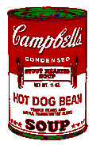

# pixmap-ops

Image manipulation demos based on the PPM image format.




## How to build

*Windows*

Open git bash to the directory containing this repository.

```
pixmap-ops $ mkdir build
pixmap-ops $ cd build
pixmap-ops/build $ cmake -G "Visual Studio 16 2019" ..
pixmap-ops/build $ start Pixmap-Ops.sln
```

Your solution file should contain two projects: `pixmap_art` and `pixmap_test`.
To run from the git bash command shell, 

```
pixmap-ops/build $ ../bin/Debug/pixmap_test
pixmap-ops/build $ ../bin/Debug/pixmap_art
```

*macOS*

Open terminal to the directory containing this repository.

```
pixmap-ops $ mkdir build
pixmap-ops $ cd build
pixmap-ops/build $ cmake ..
pixmap-ops/build $ make
```

To run each program from build, you would type

```
pixmap-ops/build $ ../bin/pixmap_test
pixmap-ops/build $ ../bin/pixmap_art
```

## Image operators
Besides the required image transformations, I have added my own additional filters:
### 1. Swirl Colors
A filter that swaps the colors of the image such that the red channel becomes the green channel, the green becomes blue, and the blue becomes red.


### 2. Invert Colors
A filter that inverts all the pixels in the image.


### 3. Add Border
A filter that adds a "tile border" effect on the north-west sides of the image given the needed thickness and color, without cropping part of the image. E.g. whote border with 3px thickness (better seen with dark Github's mode).


### 4. Extract Whites
A filter that extracts all white pixels that pass a given threshold.


### 5. Extract Main Colors
A filter that extracts RGB colors from the picture, based on which color each pixel had the most.


### 6. Lightest Blend
A filter that blends in two pictures of the same sime using the lightest mode of overlay for a given gamma.


## Results
As a result, I have created my own filter using the three filters I have described above (Extract Whites, Extract Main Colors, Lightest Blend). I wanted to create a filter that would preserve the main characteristics of the image while blending in the similar colors, which in combination creates a contrasted effect and brings up the main features of the image. Because of its nature, my filter works best on very colorful images and on simple illustrations, especially the ones with text. My filter works in the following way:
1. Extract main colors from the original picture
2. Extract whites from the picture
3. Overlay both main colored and whites images with the lighest blend.


In the future, I plan to enhance my algorithm to filter out not only red, green, blue, and white, but other colors as well, allowing it to create more precise images for pictures that don't have much color variation.
